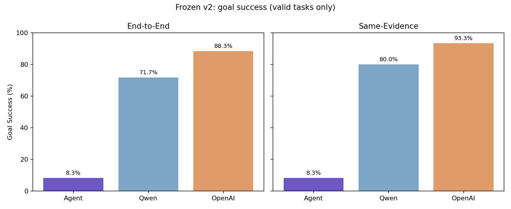

# Agent reliability v9 — frozen unseen final benchmark v2

## Design and freeze

- Product SHA: `b99d5ddf84a60086df08c08a2af546d8ae212852`; evaluation branch is not merged into main.
- Benchmark freeze commit: `a1fb8ac37a37ac8aca3b7ae989de1dc60a9c9a13`.
- Frozen tasks: 60; valid: 60; invalid: 0.
- The 60 tasks were written and compared against 160 v1/old-heldout questions before the freeze (maximum embedding similarity 0.6944; numeric-masked text similarity 0.4079; review threshold 0.82; zero near-duplicates retained). No v1 or heldout task was rerun, copied, translated, number-swapped, or paraphrased for this test. Page-level source distribution and audit details are in the manifest/preflight files.
- Agent: local `qwen3:8b`, hybrid retrieval, web off, existing 12-document/18,976-chunk ChromaDB, autonomous Python/simulation enabled. OpenAI baseline: `gpt-5.4-mini-2026-03-17`. Qwen/OpenAI baselines have no retrieval, tools, Python or web. Same-evidence baselines receive only the exact KB/FIG text captured from the Agent run; no extra retrieval or tools.
- Three-layer scoring: deterministic checks, structured expected-claim comparison, and **single-reviewer AI-assisted semantic adjudication** by local `gemma4:latest`. This is not human review. An empty final answer is deterministically scored as covering no claims and making no hallucinated assertion, even if the reviewer misattributes another answer's text. Goal Success is externally adjudicated, not the Agent's own `status` flag. Agent calculation Goal Success additionally requires validated CALC, correct formula span when applicable, full provenance, units and action sequence. Benchmarks are not independent clinical-grade ground truth. An earlier OpenAI reviewer completed 50 tasks then hit `credit_balance_exhausted`; those partial records and two F03 HTTP 429 errors are preserved under `review/` but excluded from every final metric. An initial local adjudication attempt completed 19 tasks before D02 returned extra claim verdicts; those records are preserved and excluded. Four clarification reviews were subsequently corrected to include the recorded user continuation, preserving their original review files. The final set uses one fixed local model and JSON schema for all 60 tasks.

## Track A — End-to-End Product Comparison

| System | Goal Success | Exact Accuracy | Claim Coverage | Hallucination | Numeric Accuracy | Median s | p95 s |
| --- | --- | --- | --- | --- | --- | --- | --- |
| Petroleum-RAG-Agent v9 | 8.33% | 21.67% | 28.33% | 0.00% | 21.05% | 20.03 | 69.28 |
| Qwen3:8b closed-book | 71.67% | 71.67% | 75.00% | 1.67% | 93.10% | 1.63 | 2.62 |
| OpenAI closed-book | 88.33% | 88.33% | 91.67% | 0.00% | 100.00% | 2.79 | 4.92 |

## Track B — Same-Evidence Comparison

The Agent row is the **identical** Track A output; only the two baselines are rerun with captured evidence.

| System | Goal Success | Exact Accuracy | Claim Coverage | Hallucination | Numeric Accuracy | Median s | p95 s |
| --- | --- | --- | --- | --- | --- | --- | --- |
| Petroleum-RAG-Agent v9 | 8.33% | 21.67% | 28.33% | 0.00% | 21.05% | 20.03 | 69.28 |
| Qwen3:8b same-evidence | 80.00% | 80.00% | 85.00% | 0.00% | 96.67% | 2.00 | 3.75 |
| OpenAI same-evidence | 93.33% | 93.33% | 94.17% | 0.00% | 100.00% | 2.94 | 5.36 |

## Agent reliability detail

| Agent measure | Value | Denominator |
| --- | --- | --- |
| Formula Source Correctness | 0.00% | 14 |
| Calculation Provenance Completeness | 10.00% | 30 |
| False-premise Handling | 0.00% | 4 |
| Python/Simulation Execution Success | 10.00% | 30 |
| Correct Action Selection | 50.00% | 60 |
| Same-run Resume | 0.00% | 4 |
| Citation ID Correctness | 55.00% | 40 |
| Citation Semantic Support | 28.26% | 27 |
| Document Recall@K | 79.49% | 39 |
| Page Recall@K | 46.15% | 39 |
| Figure Retrieval Accuracy | 100.00% | 4 |
| Validated CALC Adoption | 10.00% | 30 |

Mean repeated/no-progress action rate: 17.78%. Agent mean wall latency was 26.05 s. Mean stage times (seconds): retrieval 7.84, LLM generation 13.08, calculation/simulation 1.83, verification 13.80. The largest logged stage was verification, closely followed by LLM generation. These telemetry fields may overlap or omit overhead and do not sum to wall latency.

## Agent categories

| Category | N | Goal Success | Exact Accuracy | Hallucination |
| --- | --- | --- | --- | --- |
| clarification | 4 | 0.00% | 0.00% | 0.00% |
| direct_calculation | 10 | 0.00% | 0.00% | 0.00% |
| false_premise | 4 | 0.00% | 0.00% | 0.00% |
| figure | 4 | 25.00% | 50.00% | 0.00% |
| kb_calculation | 10 | 0.00% | 20.00% | 0.00% |
| literature | 18 | 5.56% | 33.33% | 0.00% |
| simulation | 6 | 50.00% | 50.00% | 0.00% |
| unsupported_formula | 4 | 0.00% | 0.00% | 0.00% |

## Paired bootstrap uncertainty

Percentile paired bootstrap by task ID, 4000 resamples, 95% CI. Numeric accuracy CIs use applicable numeric tasks only. Full point estimates and paired differences are in `statistical_analysis.json`.

| System | Goal Success 95% CI | Exact Accuracy 95% CI | Hallucination 95% CI |
| --- | --- | --- | --- |
| Petroleum-RAG-Agent v9 | 1.67–15.00% | 11.67–31.67% | 0.00–0.00% |
| Qwen3:8b closed-book | 60.00–81.67% | 60.00–81.67% | 0.00–5.00% |
| OpenAI closed-book | 80.00–95.00% | 80.00–95.00% | 0.00–0.00% |

## Agent tasks without Goal Success

| Task | Category | Exact | Source page recall | Action | Note |
| --- | --- | --- | --- | --- | --- |
| L01 | literature | False | 0.0 | True | The answer refuses to answer due to lack of source material, which is appropriate but fails to address the claims. |
| L02 | literature | True | 1.0 | True | The answer correctly states the general trend (density increases with depth) and correctly states that in overpressured zones, the trend deviates (spe |
| L03 | literature | True | 0.0 | True | Correctly identifies the trends and cites KB2, which supports the concept of porosity decrease due to increased confining stress (compaction). |
| L04 | literature | False | 0.0 | True | The answer correctly identifies the boundary influence but incorrectly attributes the primary cause of early transient to wellbore storage effects, ra |
| L05 | literature | True | 0.0 | True | The answer correctly states that Bo and GOR vary with conditions, but the supporting evidence provided (KB1, KB2) is too general and does not explicit |
| L06 | literature | False | 0.0 | True | The answer relies heavily on citations without providing the necessary detailed explanation of the physical/mathematical basis for the approximation o |
| L07 | literature | False | 0.0 | True | Does not provide a direct answer to what is missed, instead listing general checks. |
| L08 | literature | False | 0.0 | True | E refuses to answer based on lack of information, failing to utilize the information present in the gold source. |
| L09 | literature | False | 1.0 | True | The first claim is too vague ('flow rate and pressure difference control') and the second claim incorrectly describes the accumulator's function as 'd |
| L10 | literature | False | 0.0 | True | The answer is too brief and only states that re-evaluation is needed, failing to substantiate the two specific claims required. |
| L11 | literature | False | 0.0 | True | Empty final answer; deterministic guard overrides impossible reviewer assertions. |
| L12 | literature | False | 0.0 | True | The answer refuses to answer based on lack of information, failing to address the prompt. |
| L13 | literature | False | 0.0 | True | The answer claims 'indirect estimation of formation properties' is possible, which contradicts the spirit of the gold source stating 'no information'  |
| L14 | literature | True | 0.0 | True | States the apparent skin is not the same as formation damage skin due to perforation entry limitation, which is correct. However, it does not explicit |
| L15 | literature | True | 0.0 | True | The answer correctly identifies permeability contrast and geological stratification as causes, citing KB1. It correctly links these to the concept of  |
| L16 | literature | False | 0.0 | True | Failed to answer the question, only stating inability to calculate. |
| L17 | literature | False | 0.0 | True | Empty final answer; deterministic guard overrides impossible reviewer assertions. |
| D01 | direct_calculation | False | N/A | False | Empty final answer; deterministic guard overrides impossible reviewer assertions. |
| D02 | direct_calculation | False | N/A | False | The answer refused to calculate the required values, failing to address the core calculation task. |
| D03 | direct_calculation | False | N/A | False | The answer refuses to calculate the result, failing to address the core task. |
| D04 | direct_calculation | False | N/A | False | Did not attempt the calculation. |
| D05 | direct_calculation | False | N/A | False | The answer explicitly states it could not calculate the result due to lack of required data, failing to perform the simple arithmetic calculation requ |
| D06 | direct_calculation | False | N/A | False | Empty final answer; deterministic guard overrides impossible reviewer assertions. |
| D07 | direct_calculation | False | N/A | False | The task requires a direct calculation based on provided numbers, not an assessment of external engineering principles. The provided numbers are suffi |
| D08 | direct_calculation | False | N/A | False | Incorrectly refuses to answer a straightforward calculation task. |
| D09 | direct_calculation | False | N/A | False | Incorrectly refuses to answer a straightforward arithmetic problem. |
| D10 | direct_calculation | False | N/A | False | The answer correctly refuses to calculate but does not provide the required numeric result or address the core calculation based on the provided facto |
| K01 | kb_calculation | False | 0.0 | False | Empty final answer; deterministic guard overrides impossible reviewer assertions. |
| K02 | kb_calculation | True | 1.0 | False | Correctly identifies the relationship Po = Pf + Pc from KB6 and correctly calculates the result based on the provided values. |
| K03 | kb_calculation | False | 1.0 | False | The answer fails to provide the required calculation or formula, despite the source material containing the necessary information. |
| K04 | kb_calculation | False | 0.0 | False | Empty final answer; deterministic guard overrides impossible reviewer assertions. |
| K05 | kb_calculation | False | 1.0 | False | Empty final answer; deterministic guard overrides impossible reviewer assertions. |
| K06 | kb_calculation | False | 1.0 | False | Empty final answer; deterministic guard overrides impossible reviewer assertions. |
| K07 | kb_calculation | False | 1.0 | False | Empty final answer; deterministic guard overrides impossible reviewer assertions. |
| K08 | kb_calculation | False | 0.0 | False | States the correct formula definition (Pc = Po - Pw) but fails to perform the required calculation for the given values. |
| K09 | kb_calculation | True | 1.0 | False | Correctly states the formula using citation support, but fails to perform the required numerical calculation. |
| K10 | kb_calculation | False | 0.0 | False | Did not perform the calculation or estimate the numerical result because it could not confirm the necessary relationship or input values from the sour |
| S01 | simulation | False | N/A | False | Empty final answer; deterministic guard overrides impossible reviewer assertions. |
| S03 | simulation | False | N/A | False | Empty final answer; deterministic guard overrides impossible reviewer assertions. |
| S04 | simulation | False | N/A | False | Empty final answer; deterministic guard overrides impossible reviewer assertions. |
| C01 | clarification | False | 1.0 | False | Failed to calculate the final numeric result despite receiving the missing information (V2=150 scf) in the continuation. The initial answer correctly  |
| C02 | clarification | False | 0.0 | False | Empty final answer; deterministic guard overrides impossible reviewer assertions. |
| C03 | clarification | False | 1.0 | False | The final answer does not provide the numerical result, failing to meet the expectation after clarification. While the initial answer correctly identi |
| C04 | clarification | False | N/A | False | Empty final answer; deterministic guard overrides impossible reviewer assertions. |
| F01 | false_premise | False | 1.0 | False | Empty final answer; deterministic guard overrides impossible reviewer assertions. |
| F02 | false_premise | False | 1.0 | True | Does not directly address the premise or the expected claims; it only mentions evaluating a factor related to the premise. |
| F03 | false_premise | False | 1.0 | True | The answer repeats the premise in the question and does not correct it. The source material contradicts the premise. |
| F04 | false_premise | False | 1.0 | True | The answer does not explicitly reject the premise or state the required modifications, only that data must exist. |
| U01 | unsupported_formula | False | N/A | True | Fails to address the core question by simply stating it cannot calculate the result without citing the necessary physical principles or variables. |
| U02 | unsupported_formula | False | N/A | True | Failed to address the core question by stating it could not calculate anything, even though the necessary principles (like the hydrostatic pressure fo |
| U03 | unsupported_formula | False | N/A | False | Empty final answer; deterministic guard overrides impossible reviewer assertions. |
| U04 | unsupported_formula | False | N/A | False | Empty final answer; deterministic guard overrides impossible reviewer assertions. |
| G01 | figure | False | 1.0 | True | Claim 1 is supported by KB3 stating microlaterolog current flows into permeable formation. Claim 2 is contradicted by KB3, which states microlaterolog |
| G02 | figure | False | 1.0 | True | The answer makes definitive claims about the visual location based on the figure (FIG1) without providing the necessary visual evidence to support the |
| G04 | figure | True | 1.0 | True | The answer correctly interprets the figure metadata, stating that the barrier continuity is preserved and good communication exists, and no fault effe |

## Interpretation and limitations

Exact formula-span correctness was 0.00% among 14 applicable KB/clarification tasks; complete calculation provenance was 10.00% among 30 applicable tasks. These denominators are small and must be shown alongside rates.

Agent hallucination 0.00% versus Qwen closed-book 1.67% (paired difference 95% CI -5.00 to 0.00 percentage points). This is not evidence of superior factuality: 17/60 Agent final answers were empty, and 27/60 runs stopped. A confidence interval spanning zero does not establish a difference.

Goal success was Agent 8.33%, same-evidence Qwen 80.00%, and same-evidence OpenAI 93.33%; the differences describe this frozen task set, not causal attribution. Same-evidence systems did not execute Python, so their answer correctness and the Agent's operational chain are distinct measures.

Agent median latency was 20.03 s versus closed-book Qwen 1.63 s; this reflects retrieval, planning, computation and verification cost. The 4 false-premise and 4 figure tasks have wide uncertainty. Source-gold labels were prepared from existing PDFs/Chroma before freeze; semantic review is one model, not a panel of humans. The incomplete OpenAI reviewer provides a **diagnostic only** overlap of 50 tasks/250 system rows: exact claim-verdict agreement 79.60%, hallucination agreement 81.60%, and full-citation-support classification agreement 70.42% (n=71). Citation semantic scores are therefore reviewer-sensitive; no final metric mixes adjudicators. v1 became a development diagnostic set and is **not** compared as same-test final performance. Gemini was not run.

## Poster-safe conclusions

1. Exact formula-span correctness was 0.00% among 14 applicable KB/clarification tasks; complete calculation provenance was 10.00% among 30 applicable tasks.
2. Agent hallucination 0.00% versus Qwen closed-book 1.67% (paired difference 95% CI -5.00 to 0.00 percentage points). This is not evidence of superior factuality: 17/60 Agent final answers were empty, and 27/60 runs stopped.
3. Goal success was Agent 8.33%, same-evidence Qwen 80.00%, and same-evidence OpenAI 93.33%; the differences describe this frozen task set, not causal attribution. Agent median latency was 20.03 s, a visible trade-off against closed-book speed.
